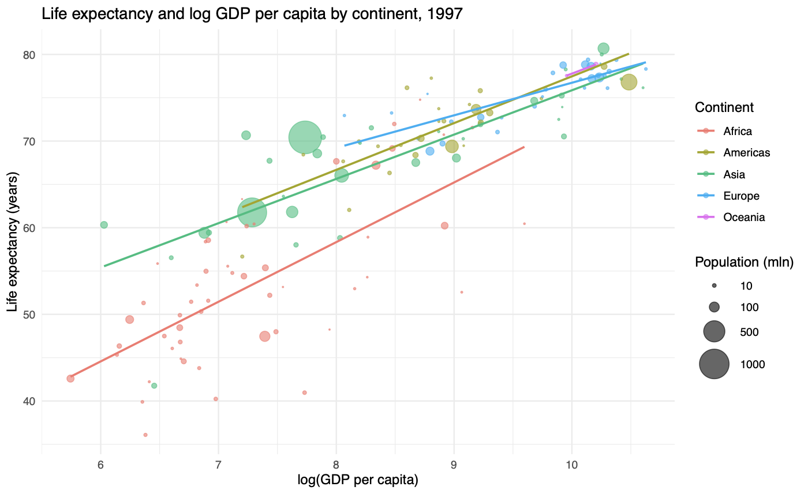
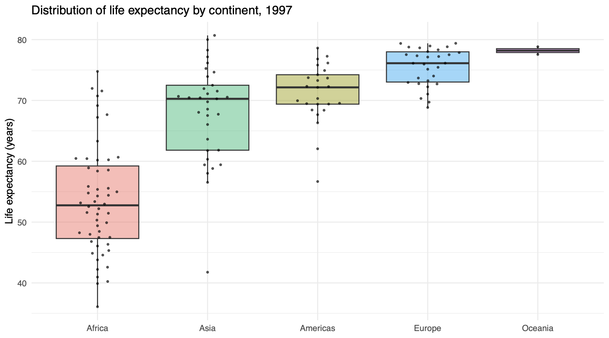
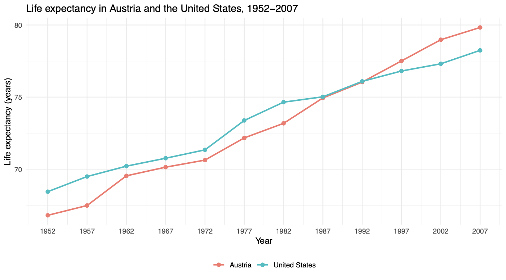
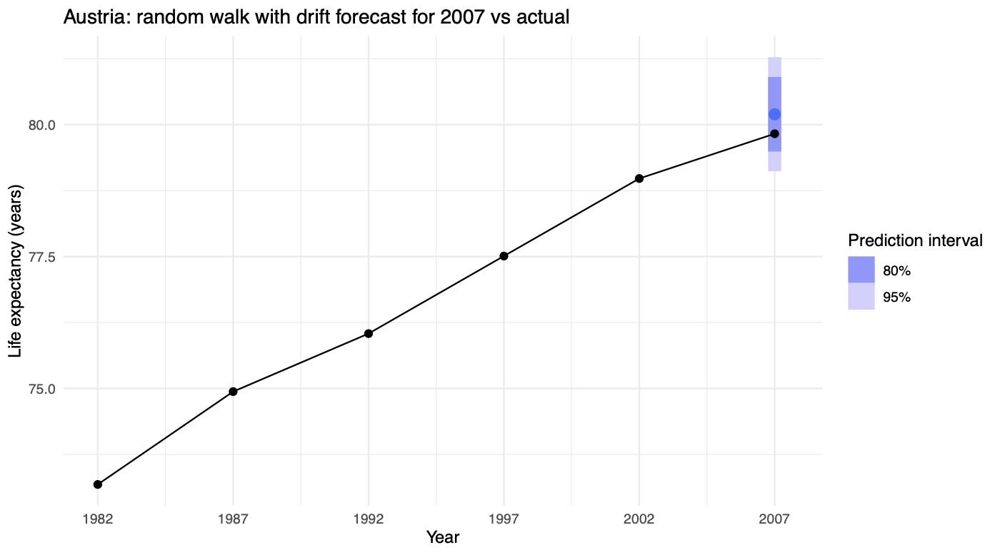

# Life Expectancy, Income and Geography

An empirical analysis of the [Gapminder](https://www.gapminder.org/) data in **R**, with the results typeset as a report in **LaTeX**.

📄 **[Read the full report (PDF)](report/report.pdf)**

Final project for *Scientific Working with R and LaTeX*, Vienna University of Economics and Business (WU).

## Research question

What explains the large differences in life expectancy across countries? How well can simple models predict it across countries and over time?

## Key findings

- **Income per person and continent explain 82% of the cross-country variation** in life expectancy (1997, 142 countries). A 1% higher GDP per capita is associated with about **0.056 more years** of life expectancy.
- **At the same income level, African countries live 8–9 years shorter** than countries on other continents.
- **Total GDP is a much weaker predictor than GDP per capita.** It mixes income with country size, and country size is unrelated to life expectancy: R² 0.65 vs 0.82, and an out-of-sample MSE of 50.8 vs 32.5 when predicting 2002 from 1997.
- **A random forest improves the predictions only slightly** (MSE 30.6). The largest errors come from Southern African countries hit by HIV/AIDS, a shock no model trained on 1997 can foresee.
- **Austria overtook the United States** in life expectancy in the 1990s. A random walk with drift forecasts Austria's 2007 value within 0.4 years.

<p align="center">
  
  
  
  
</p>

## Methods

| Part | Methods | R packages |
|---|---|---|
| Data description | summary statistics, correlations, visualisation | `tidyverse`, `modelsummary`, `ggbeeswarm`, `patchwork` |
| Regression | OLS with log income and continent dummies | `modelsummary` |
| Prediction | train on 1997, test on 2002; MSE comparison with a decision tree and a random forest | `rpart`, `randomForest` |
| Time series | random walk with drift forecast | `tsibble`, `fable` |

## Repository structure

```
├── scripts/analysis.R   # full analysis: data, tables, figures, models, forecasts
├── output/              # figures (PDF) and LaTeX tables written by the R script
├── report/
│   ├── main.tex         # LaTeX source of the report (LuaLaTeX + BibTeX)
│   ├── references.bib
│   ├── figures/         # figures used in the report
│   ├── tables/          # modelsummary tables used in the report
│   └── report.pdf       # compiled report
└── docs/img/            # PNG previews for this README
```

## Reproducing the results

**Analysis.** Install the packages listed at the top of `scripts/analysis.R`. Then run the script with the repository root (or `scripts/`) as the working directory:

```bash
Rscript scripts/analysis.R
```

All tables and figures are written to `output/`.

**Report.** Copy the outputs into `report/figures/` and `report/tables/`, then compile with LuaLaTeX:

```bash
cd report && lualatex main && bibtex main && lualatex main && lualatex main
```

## Data

`gapminder` R package (Bryan, 2025), an excerpt of the Gapminder Foundation data: life expectancy, population and GDP per capita for 142 countries, 1952–2007.

## Author

Nikita Zhdanov
